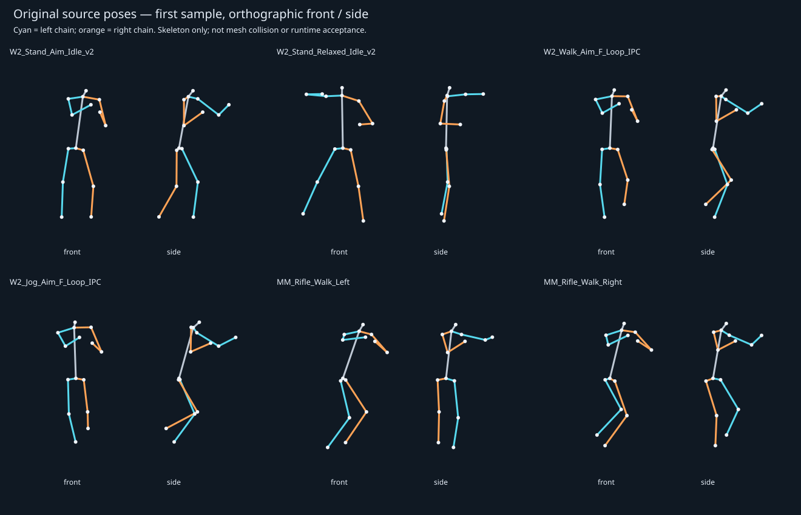

# FPS 人物体态研究 — 2026-09-27

## 结论与范围

本次只研究，没有修改游戏动画、骨骼、蒙皮、武器接触或启动配置。由主智能体独立完成。

目标是找到“整体姿态为何有力量、协调、可操作”的可验证依据。成熟方案并非统一前倾、对称摆臂，也不是把第一人称手枪组合强行放进第三人称身体。适合 Fireline 的方向是：**完整的有武器全身动作作基础，依据状态保留/释放接触，由有限修正处理角色比例差异；第一人称构图独立管理。** 这是本项目的工程建议，不能说所有游戏采用同一个实现。

本次新增：重新测量原始动画采样文件，生成21段／1701姿势的统计与骨架示意；下载并解析育碧239页讲义；核对 Epic、Bungie、Riot 的制作组资料和当前基线求解代码。已有源资产不重复下载。没有获得或解析 Apex 内部骨架文件，不把讲座简介当完整技术证据。

## 一、制作组依据

### Epic：先有全身步态，再按用途分层

[Lyra 官方动画文档](https://dev.epicgames.com/documentation/en-us/unreal-engine/animation-in-lyra-sample-game-in-unreal-engine)说明其移动片段大多是全身动作，再按骨骼遮罩叠加开火、换弹；不同武器可以拥有不同移动及修正层。四向原片、方向调整、步幅调整、距离匹配、原地转身共同构成运行效果。因此，不能拿某一帧原片的胯角，推断最终角色的全部移动行为。

[Epic 动画程序员的适配文章](https://www.unrealengine.com/tech-blog/adapting-lyra-animation-to-your-ue5-game)实际讨论替换动画后出现的脚滑、跳变、播放过快：需要连同状态退出条件、朝向与动画速度一起适配。作者给出的15–20%速度/步幅调整经验有上下文，不是本项目应机械执行的通用阈值。

### Ubisoft：身体参与，最后解决接触

[David Therriault — In Your Hands: The Character of Watch_Dogs](https://media.gdcvault.com/gdc2015/presentations/Therriault_David_InYourHands.pdf)。这是第三人称动作射击游戏经验，适用于身体协调参考，不能声称是 Apex 的方法。

本地下载22,778,157字节，PDF239页；PDF页217、223–226、232–235包含本次使用的讲者备注。关键点：体态叠加可以按骨骼、速度分配权重；朝向由躯干、肩颈、头部分段完成；武器反馈也影响身体；双臂IK结合已经变化的武器和身体姿势收尾。它支持的是“基础动作+有序修正”，不能据此推断只靠IK就会产生优美动作。

下载在 `Saved/PostureResearch/InYourHands.pdf`，文本提取在同目录；不提交或再分发PDF。提取器报告一处交叉引用警告，239页均枚举成功，上述关键页有完整可读备注；未据此宣称逐页审阅所有图表。

### Bungie 与 Riot：观感必须服务操作

[Bungie / David Helsby 的公开说明](https://www.bungie.net/7/en/News/article/12707)把第一人称反馈视为手臂、武器、摄像机的共同设计，强调响应和避免镜头造成不适。[Riot 的武器制作说明](https://playvalorant.com/en-us/news/dev/how-the-valorant-arsenal-was-built/)强调熟练、精确的操作感，以及第一、第三人称中的武器辨识。

我们的推论：第一人称可有专门构图，但第三人称仍须具备合理肩肘姿态；镜头不能直接继承头骨全部摆动。角色显得有力，取决于支撑、动作节奏和接触，不能靠扩大枪械摇摆代替。

### Apex 的证据边界

[Respawn / Alejandro Potter 的官方GDC讲座入口](https://www.gdcvault.com/play/1027904/Animation-Summit-Sustained-Animation-Excellence)已核实。此次只读到公开简介，没有完成视频内容核验，没有源动画。因此没有“Apex肩膀应转X度”“Apex内部使用某求解器”的结论。

## 二、重新解析的动画数据

来源是先前已下载原件导出的原始姿势，不是我们改过的游戏动画。使用两个保留的采样文件，每个文件的SHA256记录于 `metrics.json`；脚本只读取位置，不跨骨架复制欧拉角。

| 来源 | 本次采用 | 用途与边界 |
|---|---|---|
| [MoCap Online 官方免费演示](https://mocaponline.itch.io/mocap-online-demo) | 5段，305姿势；去除Walk/Jog的Root Motion重复版本 | 有枪瞄准待机、放松、转换、前走、慢跑；缺完整持枪冲刺与八向转换 |
| Epic Lyra 官方原片 | MM/MF各8段，合计1396姿势 | 对比前后左右Walk/Jog；原片不等于最终AnimGraph输出 |

没有新增未经许可的游戏拆包；免费演示并非自动等于CC0。脚本和汇总统计可以版本控制，源FBX、uasset、骨骼动画矩阵仍留在本地。

### 1. “战斗准备”与“放松”确实是不同体态

以下是 MoCap 同一骨架的中位数；躯干总倾角是“骨盆到颈部连线相对竖直”的角度，包含侧倾，不能直接用作腰骨旋转。

| 状态 | 躯干总倾角 | 左肘内角 | 右肘内角 | 双腕距离最大减最小 |
|---|---:|---:|---:|---:|
| 瞄准待机 | 10.8° | 100.8° | 52.8° | 0.11cm |
| 瞄准前走 | 9.2° | 121.8° | 59.7° | 0.43cm |
| 瞄准慢跑 | 15.3° | 125.4° | 59.6° | 0.21cm |
| 放松待机 | 1.4° | 90.7° | 68.4° | 26.45cm |

肘内角180°表示伸直；屈曲角=180°−内角。旧文档的55°/120°使用屈曲口径，不能直接与本表的125°/60°比较。本次明确记录公式。

可得出的结论：两手持枪的动作明显不对称；行走并没有比待机更大幅弯腰；放松待机存在左腕相对右腕的大幅变化。双腕距离接近常数是稳定接触的一项证据，**不是六自由度握持完全准确的证明**。是否接触护木、扳机，还须看枪体与手掌朝向。放松片段的大幅变化也不能误报成锁手算法损坏。

Aim→Relaxed转换中，总倾角从10.87°变到1.08°，右肘内角52.73°变到68.41°。躯干、两臂会一起改变，不能只移动枪或只拉直某节手臂。

### 2. 侧移不是“身体完全不转”，也不是“转整个腰代替腿动”

Lyra MM的左右行走原片，肩线相对髋线的水平偏航差中位数约38.2°/32.0°；前走约−8.7°。这说明成熟原片本身会有上下身朝向分工。该角由左右肩与左右髋的位置线计算，不是某一根腰骨的局部旋转。

但这些数值既不证明用户喜欢的侧向交叉步已经实现，也不能直接用来给Ryan加同等腰扭转。必须看整段抬脚、落脚、足部接触和最终融合。其MM慢跑双腕距离变化可达约3–7cm，说明原片也不能无条件当成目标枪械严格双手接触模板。

### 3. 肘部外侧投影不等于碰撞检测

MoCap前走右肘相对右肩沿肩线外侧投影约9.56–11.29cm；左肘则可以略处于左肩内侧。右手握后方握把、左手支撑前方护木，几何分工不同。

因此不能对左右肘套同一“必须在肩外”的规则。即便肘在肩内侧，整条上臂也可能位于胸前而没有穿身；反之，肘点合法也可能让手臂表面穿护甲。需要完整上臂/前臂与躯干体积、蒙皮表面验证。

### 4. 骨长不变，是必要条件，不是体态好看的充分条件

MoCap上臂、前臂位置段长度在采样精度下恒定。IK可以同样满足固定骨长，却选到错误肘弯平面；还可能因目标过远把关节逼近完全伸直，再出现极向跳变。因此必须同时检查源动作形态、接触可达性和时间连续性。

完整数值：[measurements.md](measurements.md)；机器可读：[metrics.json](metrics.json)。



示意图保留原始采样坐标，仅画关节点连线，蓝=左、橙=右。它不是解剖骨架建模，不包含肩胛、真实网格、武器和最终朝向层。第一帧也不代表整段动作的典型姿势。

## 三、对照当前代码：我们真正需要解决什么

检查基线 `cabb8aa` 的 `Source/Fireline/Range/RangeBodyPose.cpp`、`RangeContactCarry.cpp` 及右臂修复记录；没有启动被否决的SourceBody/CombatGround实验。

| 现有处理／证据 | 风险或已知缺陷 | 下一步应检查的内容 |
|---|---|---|
| ContactCarry按状态重新配准躯干，手枪组合另有原始接触锚 | 躯干肩部与接触锚变化量不同，可能把差额压给肘腕；属于代码结构风险，不是每帧必然出错 | 逐层记录肩、枪、腕、肘；计算修正前后偏离来源 |
| BodyPose先求臂，ContactCarry后面再次求臂 | 已确认此前的M4右肘会被最后一层带回肋部 | 每帧明确最后写入者；以最终蒙皮而非中间层验收 |
| 肘圆同时满足臂长与腕部方向 | 数学可解仍有许多外观不同的肘位置 | 保留来源肘平面，躯干净空作为约束；不可达时调整整套姿态 |
| 上次新增右肩外侧平面约束 | 是局部修复，不是人体体积或护甲碰撞模型 | 胸腹代理体积＋手臂段半径；关键帧查真实网格 |
| 候选肘位置后还有历史极向限速 | 连续处理之后是否仍满足净空，需要最终位置复测 | 此项是风险待测，不能冒充已经复现的穿模 |
| 持枪接触使用共同锚 | 两手与枪的相对关系能保留，肩膀和腕姿仍需适配 | 按武器尺寸、枪托位置，验证完整链，而非分离挪手 |

我们此前过度依赖“距离为零、角度没超限、编译通过”来判断完成。它们只能排除部分错误，无法代替体态、动作时序与蒙皮观感。

## 四、适合本项目的体态规范（建议，尚未实现）

| 状态 | 全身应表达什么 | 接触和视角原则 |
|---|---|---|
| 战斗待机 | 有支撑的足距，髋膝留活动余量，躯干准备姿态，头朝目标 | 左手托护木、右手握把；枪托与肩窝协调；不要强求左右对称 |
| 普通持枪行走 | 重心转移、迈步和躯干轻微反向配合 | 枪稳定，反馈小；避免前后戳枪 |
| 左右／斜向移动 | 源片确实有相应落脚与摆腿，胸口维持战斗意图 | 允许自然髋部转动；不能只旋转骨盆生成全部侧移 |
| 持枪冲刺 | 身体加速意图和武器携行方式一体，明显区别于行走 | 两手继续持枪时不做空手式反向大摆臂；松手冲刺必须有专用接触时序 |
| 瞄准／移动开火 | 头颈、肩、脊柱共同接近瞄准关系 | 保留现有开火限速、程序后坐力；第一人称保证准星与瞄具稳定 |
| 换弹 | 右手与枪可保持主连接，左手按任务移动，肩肘带动腕 | 左手离枪→取弹匣→插入→操作→回握；只有需要时启用相应接触 |
| 起跳／落地 | 踝膝髋参与发力与吸收，躯干跟随，不是单独点头 | 保持瞄准能力；镜头另做克制反馈，不能直接拷贝头骨抖动 |
| 起停／急反向 | 支撑脚、髋位移、躯干惯性共同过渡 | 状态改变不能把肘的弯曲方向或脚步相位清零 |

这是动作内容与验收要求，不是已经找到覆盖全套动作的免费素材。本次样本不足以确定冲刺、跳跃、滑铲的完整生产方案。

## 五、实施顺序与停止条件

1. **只做M4静止到前走的小闭环。** 同屏显示原始供体、仅重定向、接触修正、游戏最终姿势。保留当前已认可第一人称和枪握关系，不直接整包替换。
2. **先找第一层错误。** 原片是否合理？重定向后是否出现肩胯方向偏差？接触层是否引入腕折或肘内插？分别定位，禁止最后再堆一个通用偏移遮盖。
3. **按身体比例适配整条链。** 保留Ryan/DJ原生绑定与蒙皮。源骨长、目标骨长、腕参考坐标、枪长和握点必须同一空间比较。肩→肘→腕协同；无法同时满足时调整携枪整体姿态，不能伸长前臂。
4. **低成本先看最关键画面。** 固定正面、侧面、背面与第一人称；正常速度和慢放检查。静止、连续步态、起停三组先合格，再扩到横移、俯仰和操作。
5. **最终帧再次验证。** 检测臂段与躯干体积、腕方向、握点误差、骨长、肘平面连续性；这些通过以后仍检查网格与播放观感。
6. **成功才扩大覆盖。** 同一方法两次仍明显失败，停止加系数，检查原片/绑定空间/求解权责。MP7、刀、滑铲和全部动作不捆绑一次“大修”。

不能承诺一次实现所有状态零穿模，更不能用原片统计当验收。应提供可复查的前后对照，在所测状态之外明确保留未知项。

## 复现

```sh
python3 unreal/Fireline/Docs/Research/fps-posture/analyze.py '/Users/hht/Documents/ChatGPT/火力对决/unreal/Fireline/Docs/Research'
```

所需输入是旧项目保留的原始采样；不随本仓库分发。MCO导出脚本为旧项目 `Scripts/inspect_downloaded_mco_sources.py`，读取FBX骨骼矩阵；Lyra来源、原件哈希及导出说明见旧项目 `Docs/Research/strafe-source-review/lyra/`。本次没有重新从FBX/UE抽样，重新计算的是既存原始矩阵采样，不伪称新增动捕或模型资源。
